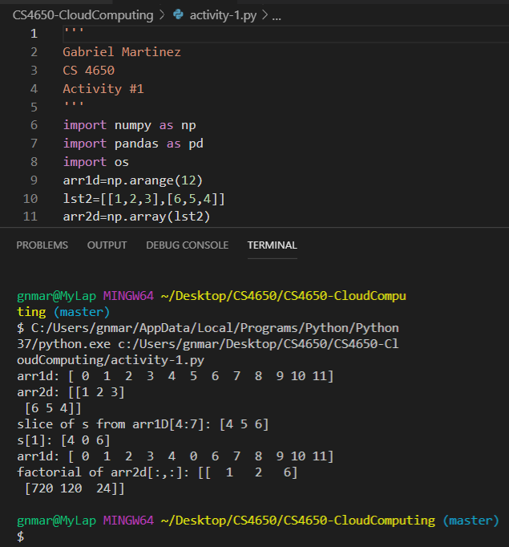

# Activity-1
This task for this activity was to be familar with python basics.

## Python code
```python
'''
Gabriel Martinez
CS 4650
Activity #1
'''
import numpy as np
import pandas as pd
import os
arr1d=np.arange(12)
lst2=[[1,2,3],[6,5,4]]
arr2d=np.array(lst2)
print("arr1d: {}".format(arr1d))
print("arr2d: {}".format(arr2d))
s=arr1d[4:7]
print("slice of s from arr1D[4:7]: {}".format(s))
s[1]=0
print("s[1]: {}".format(s))
print("arr1d: {}".format(arr1d))
def factorial(a):
    if a==1:
        return 1
    else:
        return a*factorial(a-1)
vfunc = np.vectorize(factorial)
result = vfunc(arr2d[:,:]) 
print("factorial of arr2d[:,:]: {}".format(result))
```

## Output

